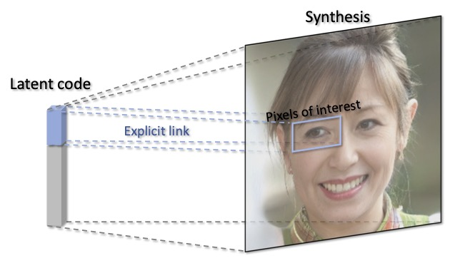

# LinkGAN: Linking GAN Latents to Pixels for Controllable Image Synthesis

<div align=center>

</div>

Figure: Concept diagram of LinkGAN, where some axes of the latent space are \textit{explicitly} linked to the image pixels of a spatial area. In this way, we can alter the image content within the linked region simply by resampling the latent code on these axes.

> **LinkGAN: Linking GAN Latents to Pixels for Controllable Image Synthesis** <br>
> Jiapeng Zhu*, Ceyuan Yang*, Yujun Shen*, Zifan Shi, Deli Zhao, Qifeng Chen <br>
> *arXiv preprint arXiv:* <br>


**Figure:** *Precise local control achieved by LinkGAN on 2D image synthesis, like StyleGAN2 (left three columns), and 3D-aware image synthesis, like EG3D (right two columns). It is noteworthy that, under the 3D-aware case, we can control both the appearance and the underlying geometry.*

[[Paper]()]
[[Project Page](https://zhujiapeng.github.io/linkgan/)]

In the repository, we propose *LinkGAN* to explicitly link some latent axes to a region of an image or a semantic via an easy-to-implement yet powerful regularizer. Building such a connection facilitates a more convenient local control of GAN generation, where users can alter the image content within a spatial area simply by *partially resampling* the latent codes. Extensive experiments on 2D image synthesis (*e.g.*, StyleGAN2) and 3D-aware image synthesis (*e.g.*, EG3D) demonstrate the effectiveness of our proposed method.


## Results

|  |   |      |     |  |
|  :-- |  :--  |  :-- | :-- | :--  |
|  |  |  |  | 

## Code Coming Soon

## BibTeX

```bibtex
@article{zhu2022linkgan,
  title   = {LinkGAN: Linking {GAN} Latents to Pixels for Controllable Image Synthesis},
  author  = {Zhu, Jiapeng and Yang, Ceyuan and Shen, Yujun and Shi, Zifan and Zhao, Deli and Chen, Qifeng},
  journal = {arXiv preprint arXiv:},
  year    = {2022}
}
```
